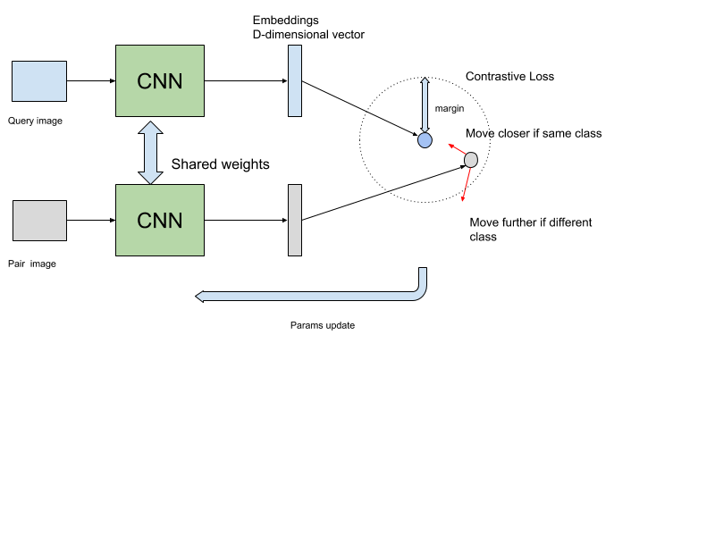
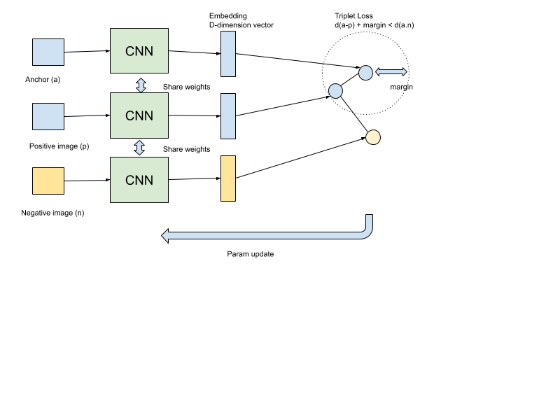
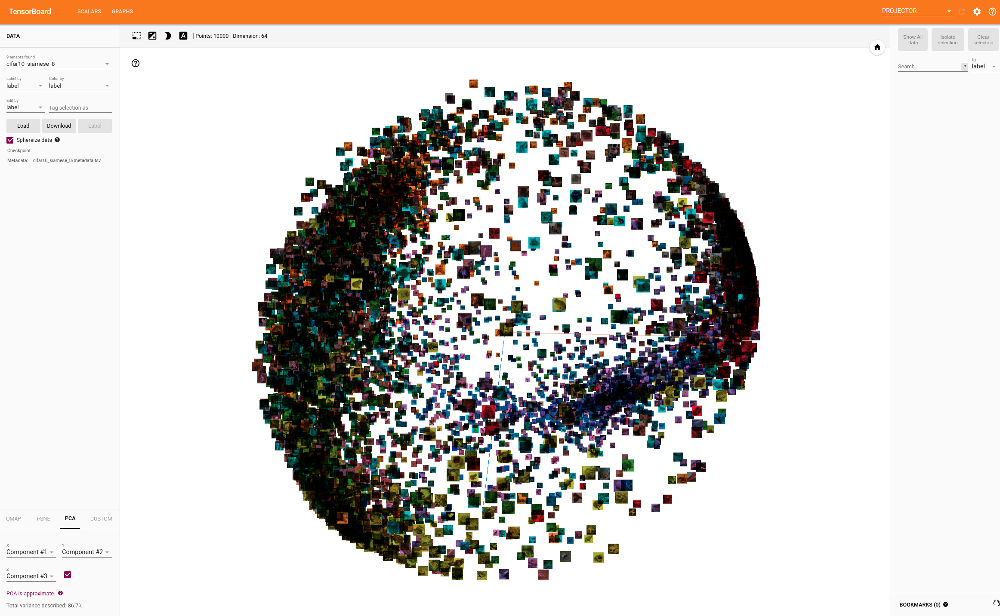

# Implementing siamese and triplet network in mxnet

## Summary
This repository implement siamese network and triplet network using mxnet and gluoncv. 

Siamese network and triplet network are standard tools for Deep Metric Learning. 
In recent year, there're more advance methods that produce better modern 
(see [DMLPlayground](https://github.com/ifeherva/DMLPlayground) for a list of comparing). 
If you want more advance methods, please go there.  

The Siamese network has architecutre as follow. 



The Triplet network has architecture as follow.




## How to use

* Install requirement

```bash
pip install --upgrade mxnet gluoncv mxboard tensorboard
``` 

## Experiment

The experiments were done on cifar10 dataset which resnet18 as basebone network.

* Train the siamese network

```bash
bash train_cifar_siamese.sh
```

* Train the origin triplet network

```bash
bash train_cifar_triplet.bash
```

* Train the triplet network using semihard mining

```bash
bash train_cifar_triplet_semihard.sh
```

By default, for each experiment abive, the result will be stored inside following location

```bash
└── cifar10                         : dataset
    ├── siamese                     : network
    │   └── 202002110921            : timestamp
            │       ├── logs        : log file
            │       └── params      : snapshot
    ├── triplet         
    └── triplet_semihard
        ├── 202002141551
```

The training loss and embedding is sotred as tensorboar's log. So run the following command to view it.

```bash
tensorboard --logdir cifar10/siamese/202002110921/logs
```



## Reference

1. [https://qiita.com/gesogeso/items/547079f967d9bbf9aca8](Deep Metric Learning 入門)
2. [https://github.com/ifeherva/DMLPlayground](Distance Metric Learning Playground)
2. [https://omoindrot.github.io/triplet-loss](Triplet Loss and Online Triplet Mining in TensorFlow)


